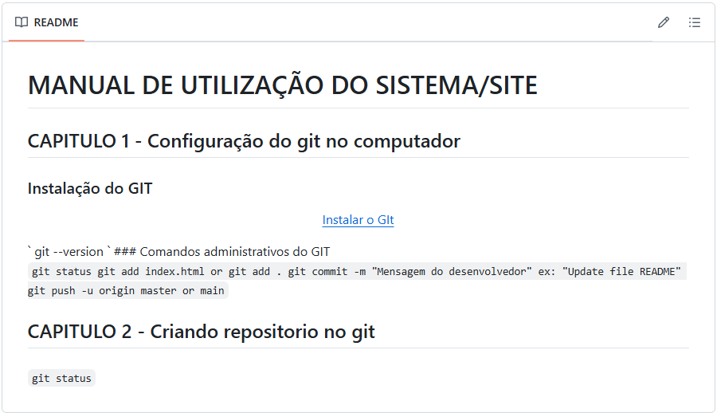

# MANUAL DE UTILIZAÇÃO DO SISTEMA/SITE
## CAPITULO 1 - Configuração do git no computador
### Instalação do GIT 

    

`
git --version
`

### Comandos administrativos do GIT

`
git status
`
`
git add index.html or git add .
`
`
git commit -m "Mensagem do desenvolvedor" ex: "Update file README"
`
`
git push -u origin master or main
`
## CAPITULO 2 - Criando repositorio no git
### 

`git status`