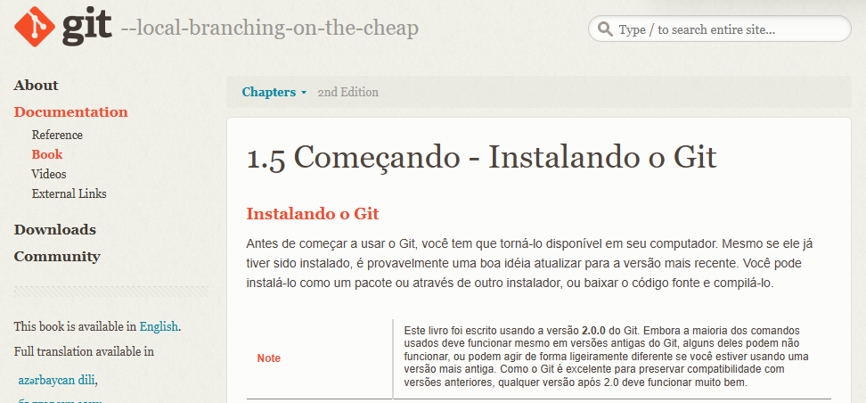

# MANUAL DE UTILIZAÇÃO DO SISTEMA/SITE
## CAPITULO 1 - Configuração do git no computador
### 1.1. Consultano documentação do GIT
<p align="justify">
    Realize a busca do termo [Instalar GIT](https://git-scm.com/book/pt-br/v2/Come%C3%A7ando-Instalando-o-Git) para Windows.
</p>

<p align="center">
    <a href="https://git-scm.com/book/pt-br/v2/Come%C3%A7ando-Instalando-o-Git" target="_blank">
        
    </a>
</p>

### 1.2. Verificando a instalação do GIT

```
git --version
```
<p align="center">
    
</p>

### 1.3. Caso nao esteja instalado

<p align="justify">
    Acesse o item 1 para instalar baixando o git da versão do seu computador [Instalar o GIT - Download](https://git-scm.com/downloads) versão Windows.
    <center></center>
</p>

### 1.4. Conectando o GIT no Windows

<p align="justify">
Após realizar a instalação é necessário identificar qual usuário irá ser utilizado para versionar os arquivos.
Para realizar o creenciamento do GIT no Windows faça:
</p>

```
git config --global user.name "Edir P Santos"

git config --global user.email fennder@gmail.com
```

### 1.5. Criando o par de chaves

<p align="justify">
Após, identificação de usuário, gerar a chave púlica para autorizar a troca de arquivos entre GIT e Sistema Operacional.
</p>

```
ssh-keygen
```

<p align="center">
    
</p>

### 1.6. Copiando conteudo da chave pública

<p align="justify">
Acesse a pasta .ssh como comando:

```
cd .ssh
```
Execute o comando de leitura de arquivo o "cat".

<center></center>
</p>

## CAPITULO 2 - Criando repositorio no git

### 2.1. Incluindo chave pública no GIT

<p align="justify">
Antes de criar o repositório no GIT, realize a inserção da chave pública cropiada no item 1.6. Copiando conteúdo da chave pública 

Navegando em:
</p>

<p align="center">
    
</p>

<p align="justify">
    Entrando em Settings.
</p>

<p align="center">
    
</p>

<p align="justify">
    Entrando em SSH keys and GPG keys.
</p>

<p align="center">
    
</p>

### Criando Projeto

<p align="justify">
    Acesse o [GitHub](https://github.com/) no navegador.
</p>
<p align="center">
    <a href="https://github.com/" target="_blank">
        
    </a>
</p>

### Processo de clone do projeto

<p align="justify">
    Foi necessario realizar toda a configuração.
</p>


### Comandos administrativos do GIT

```
git status

git add index.html or git add .

git commit -m "Mensagem do desenvolvedor" ex: "Update file README"

git push -u origin master or main
```